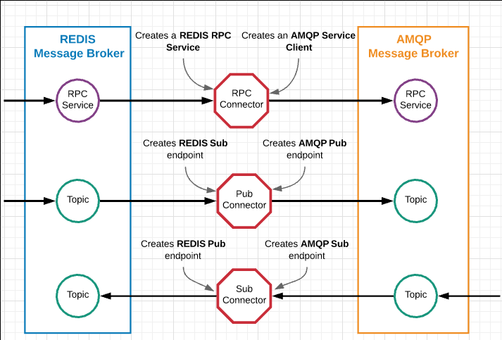

# commlib-py
Broker-based communication framework written in python 3.
Implements the most common communication patterns (RPC/ReqResp, PubSub) over a message broker.
A message broker is a communication middleware responsible for routing messages to the
proper endpoints. Some examples of message brokers are: AMQP-based brokers (e.g. RabbitMQ),
Apache Kafka, MQTT brokers (e.g. Mosquito) and Redis.

Yes, Redis can also be used as a message broker for RPC and PubSub communication!!


# Installation


```bash
python setup.py install
```

or

```bash
pip install . --user
```

# Features
The purpose of this implementation is to provide an application-level communication layer, 
by providing implementations for Remote-Procedure-Calls (RPCs), Topic-based PubSub, Preemptable Services
(aka Actions), Events etc.

## Transports
TODO

### AMQP / RabbitMQ

AMQP RPC (request/reply) and PubSub Endpoints are supported by the protocol itself, using
deticated exchanges.

For RPC enpoints a `Direct Exchange` is used to route requests and responses,
optionally using the [Direct Reply-to](https://www.rabbitmq.com/direct-reply-to.html).
If the `Direct Reply-to` feature is used, then RPC endpoints must publish
to the default exchange `""`.

To use `Direct Reply-to`, an RPC client should:
- Consume from the pseudo-queue `amq.rabbitmq.reply-to` in no-ack mode.
- Set the `reply-to` property in their request message to `amq.rabbitmq.reply-to`.


### Redis

PubSub endpoints uses the out-of-the-box [Redis pubsub channel](https://redis.io/topics/pubsub).

Though, Req/Resp communication (RPC) is not supported out-of-the-box. To support
RPC communication over Redis, a custom layer implements the pattern for both endpoints 
using Redis Lists to represent queues. RPC server listens for requests from
a list, while an RPC client sends request messages to that list. In order for
the client to be able to receive responses, he must listen to a temporary queue.
To achieve this, the request message must include a `reply_to` property that is 
used by the RPCServer implementation to send the response message. Below is the 
data model of the request message.

```
{
  'data': {},
  'meta': {
    'timestamp': <int>,
    'reply_to': <str>,
    'properties': {
      'content_type': 'application/json',
      'content_encoding': 'utf8'
    }
  }
}
```

Furthermore, `content_type` and `content_encoding` properties must be set 
for serialization/deserialization purposes.


**Note**: The **RPC Client** implementation is responsible to remove any created 
temporary queues!


### NATS

**NOT YET SUPPORTED**


### MQTT


**NOT YET SUPPORTED**


## Endpoints
TODO

### RPCService
TODO

### RPCClient
TODO

### Publisher
TODO

### Subscriber
TODO

### ActionServer
TODO

### ActionClient
TODO

### EventEmitter
TODO

## Broker-to-broker (B2B) bridges



# Examples

Examples can be found at the `./examples` directory of this repo

# Tests

TODO

# Roadmap

TODO

# Credis

TODO
